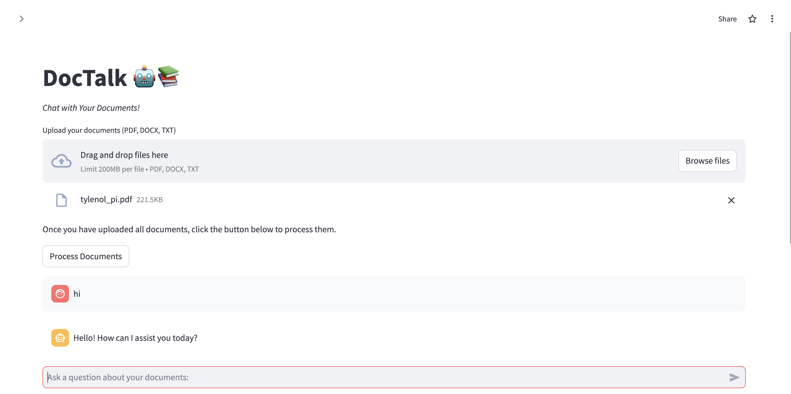
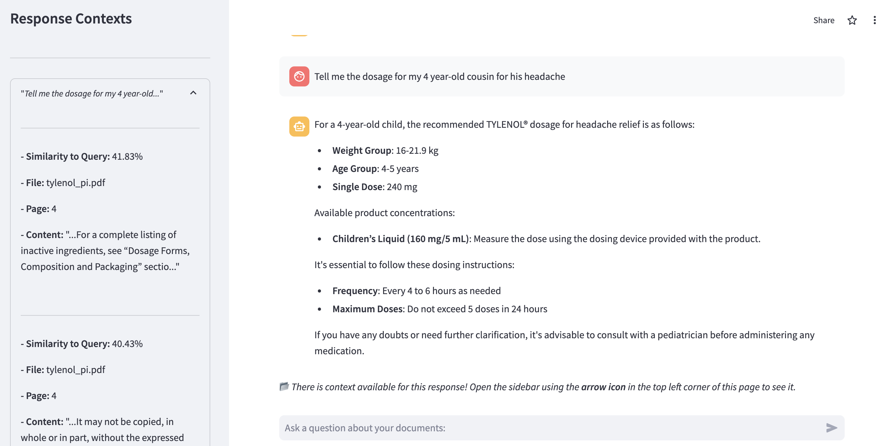

# DocTalk 🤖📚

**DocTalk** is a Streamlit-based web application that allows users to upload and interact with their documents (PDF, DOCX, TXT) using natural language queries. The application leverages OpenAI's [GPT-4o model](https://platform.openai.com/docs/models/gpt-4o) for query validation and chatting, and [text-embedding-3-small](https://platform.openai.com/docs/guides/embeddings/embedding-models) to understand and respond to user queries based on the content of the uploaded documents.

## Features
- **Upload and Process Documents**: Upload PDF, DOCX, and TXT files for text extraction and processing.
- **Custom Chunking & Token Counting**: Custom chunking of documents to improve context retrieval and response generation. Uses NLTK's sentence tokenizer to sentence tokenize the documents, followed by token counting using [tiktoken](https://github.com/openai/tiktoken) to manage chunk sizes.
- **Chat with Documents**: Ask questions about your uploaded documents and receive context-aware responses.
- **Cosine Similarity for Context Retrieval**: Utilizes cosine similarity to find the most relevant document chunks in response to user queries.
- **Query Validation**: Uses a secondary API call to validate if a query needs document context, ultimately saving tokens and reducing costs.
- **Simple App Passcode Authentication**: Access to the app is protected by a passcode to ensure only authorized users can interact with the documents.

## Installation

1. **Clone the repository**:
    ```bash
    git clone https://github.com/kmaurinjones/doc-talk.git
    cd doc-talk
    ```

2. **Create a virtual environment** (optional but recommended):
    ```bash
    python3 -m venv env
    source env/bin/activate
    ```

3. **Install the required packages**:
    ```bash
    pip install -r requirements.txt
    ```

## Environment Variables

Create a `.env` file in the root of your project and add the following environment variables:

```plaintext
SIMPLE_AUTH_PASSCODE=your_passcode
OPENAI_API_KEY=your_openai_api_key
```

## Running Locally

To run the application locally, use the following command:

```bash
streamlit run app.py
```

This will start the Streamlit server, and you can access the app at `http://localhost:8501`.

## Accessing the Deployed App

The application is also deployed and can be accessed via the following URL:
[DocTalk Deployment](https://docs-talk.streamlit.app/)

## Usage

1. **Upload Documents**: Upload PDF, DOCX, or TXT files using the file uploader in the app.
2. **Process Documents**: Click the "Process Documents" button to extract and process the text from the uploaded files.
3. **Chat with Documents**: Use the chat input to ask questions about the content of the uploaded documents. The app will provide responses based on the processed text and context from the documents.

## Examples

Here are some screenshots of the DocTalk application in use:

### Uploading and Processing Documents


### Query and Response Context



## Contributing

Contributions are welcome! Please open an issue or submit a pull request for any improvements or bug fixes.

## License

This project is licensed under the MIT License. See the `LICENSE` file for details.

## Contact

For any questions or issues, please contact me at [kmaurinjones@gmail.com](mailto:kmaurinjones@gmail.com)